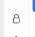
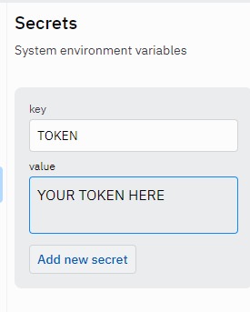

# Put Token In File .env (If you use VS Code)
1. Create file .env on vs code
2. Type ``TOKEN=YOUR-TOKEN``
--------
# If You Use Replit Then you will do the following
1.  Please click file icon lock
2.  Do as the picture above

# Note!
Replace the id [931466272779157555] With The Role You Wanna Give

In Line 22 of main.py, Replace the id [909393620904333403] with your server id

Finally replace .gg/mineyah with your server vanity or link!